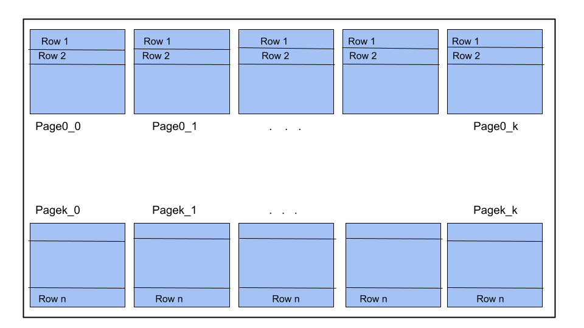

 
# PHASE 1
## LOAD MATRIX

### Logic:

- Read csv file line by line.

- Store each line in blocks. Max 15 elements of each row will be stored in each block (calculation explained below). If any page has less number of elements, then we have done padding using zeros. These padded elements will not be considered as a part of the actual matrix. But we need them for performing other commands like transpose, checksymmetry and compute.

    - Max rows per block = 15

    - Max columns per block = 15

    - Max blocks per row (k) = ceil(n/15), where n is number of rows in matrix

    - Max blocks per column (k) = ceil(n/15), where n is number of column in matrix

    - Max blocks per matrix (b) = ceil(n\*n / 15\*15)

    - Total number of elements in 1 page = 15 \* 15 = 225

    - Total size of elements = 225 \* size of integer = 225 \* 4B = 900B which is less than the bloc size (1000 B).

- We have used a 3D vector to store the data temporarily.

- Number of elements in vector = max blocks per row \* max rows per block \* max columns per block = k \* 15 \* 15,

- The vector stores all the elements of 15 rows at a time. Then these elements are stored in temp files as: <matrix name>\_MatrixPage&lt;i&gt;\_&lt;j&gt;.
Here, we have used i and j to number the pages so that it will be easy to perform the transpose of the matrix using the block transpose method.

### Page Design:

 

### Number of block access:

- To store one row of matrices, we need k blocks. Number of block written for 1 row = k

- We have to store n such rows, therefore, total number of block written = number of rows \* number of blocks written

for 1 row = n \* k

- Number of blocks accessed = Number of blocks read + Number of blocks written
			    = 0 + n\*k
		            = n\*k

---

## PRINT MATRIX

### Logic:

- Read the rows of the matrix one by one from the k pages stored in the temp folder. Here we are required to print only the first 20 elements from the first 20 rows.

- We have generated 'k' cursors using pageId. These cursors initially refer to the first 'k' pages. These cursors then retrieve the first rows from each page, print them on the output screen, and increment the cursor to the next row on each page.

- After getting all elements from the first ‘k’ pages, we have incremented the pageId with ‘k’ so they point to the next ‘k’ pages.

### Number of block access:

- We have to print only 20 rows and 20 columns of the matrix, ie. 400 elements. So we need to read only 4 blocks for printing the matrix. (We have stored 15\*15 = 225 elements in one page)

- We will get rows 0 to 14 from Page0\_0 and Page 0\_1, rows 15 to 19 from Page1\_0 and Page1\_1.

- Number of blocks accessed = Number of blocks read + Number of blocks written
		            = 4 + 0
		            = 4

---

## TRANSPOSE MATRIX

### Logic: 

- We have used the “Block Transpose” method to perform the transpose of the matrix.

- The matrix is already divided and stored into blocks of size 15\*15 each at the time of loading the matrix.

- For doing block transpose, we need to perform the transpose operation on each block internally and then perform transpose on the blocks.

 

So, we have two cases:

- Case 1: Page is of type <matrix name>\_MatrixPage&lt;i&gt;\_&lt;i&gt;
In this case, we need to perform only the internal transpose of elements and store the resultant transpose in the same Page&lt;i&gt;\_&lt;i&gt;.

- Case 2: Page is of type <matrix name>\_MatrixPage&lt;i&gt;\_&lt;j&gt;
In this case, we need to perform an internal transpose of elements first and after that we need to swap the contents of Page&lt;i&gt;\_&lt;j&gt; with the contents of Page&lt;j&gt;\_&lt;i&gt; .

- We have performed the internal transpose by storing the elements of page into a temporary 2D vector and performed the regular transpose operation.

- For swapping the contents (as in case 2), we have written the resultant transpose of Page&lt;i&gt;\_&lt;j&gt; to Page&lt;j&gt;\_&lt;i&gt; and vice versa.

### Number of block access: 

- We need to read and write every block once.

- Number of blocks accessed = Number of blocks read + Number of blocks written
		            = b + b
		            = 2b

---

## EXPORT MATRIX

### Logic: 

- Read the rows of the matrix one by one from the k pages stored in the temp folder. 

- We have generated 'k' cursors using pageId. These cursors initially refer to the first 'k' pages. These cursors then retrieve the first rows from each page, write them into a csv file in data folder, and increment the cursor to the next row on each page. 

- After getting all elements from the first ‘k’ pages, we have incremented the pageId with ‘k’ so they point to the next ‘k’ pages.

### Number of block access:

- We need to read every block once.
- Number of blocks accessed = Number of blocks read + Number of blocks written 
                                                         = b + 0
    = b

### Error Handling

- Syntactic errors handled.
- Semantic errors handled.

---

## RENAME MATRIX

### Logic:

- We have all the pages of matrix in temp folder. To do the rename operation, we have renamed all the page files in temp folder from &lt;old_matrix_name&gt;_MatrixPage&lt;i&gt;_&lt;j&gt; to &lt;new_matrix_name&gt;_MatrixPage&lt;i&gt;_<j&gt;.

- Also we have updated the new matrix name in the map.

---

## CHECKSYMMETRY

### Logic:

- The matrix is divided and stored into blocks of size 15*15 each.

- For checking if the matrix is symmetric, we have two cases:
    - Case 1: Page is of type &lt;matrix name&gt;\_MatrixPage&lt;i&gt;\_&lt;i&gt;. In this case, we need to check only the internal symmetry of elements in the block. 
    - Case 2: Page is of type &lt;matrix name&gt;\_MatrixPage&lt;i&gt;\_&lt;j&gt;. In this case, we need to check the symmetry of elements of Page&lt;i&gt;\_&lt;j&gt; with the elements of Page&lt;j&gt;\_&lt;i&gt; .

- We need to perform the operations for maximum of k\*(k-1)/2 times in order to know if the matrix is symmetric or not.

- If inequality is found in any comparison step, we will return FALSE from the function, and will not check anything further. 

- If we do not find any inequality while checking for all the elements, we will return TRUE. 

### Number of block access:

- We need to read every block once.
- Number of blocks accessed = Number of blocks read + Number of blocks written 
    = b + 0
    = b

---

## COMPUTE

### Logic:

- The matrix is already divided and stored into blocks of size 15*15 each.

- For performing the compute operation, we have two cases:
    - Case 1: Page is of type &lt;matrix name&gt;\_MatrixPage&lt;i&gt;\_&lt;i&gt;. In this case, if we consider the elements of page (P) according to the regular indexing of 2D vectors, the compute values will be as follows: If the element is of type P\[r\]\[r\], P\[r\]\[r\] = 0.
If the element is of type P\[r\]\[c\], P\[r\]\[c\] = P\[r\]\[c\] - P\[c\]\[r\]. 
    - Case 2: Page is of type &lt;matrix name&gt;\_MatrixPage&lt;i&gt;\_&lt;j&gt;. In this case, considering the following notations: 
        - Elements of Page&lt;i&gt;\_&lt;j&gt as a 2D vector = Pij
        - Elements of Page&lt;j&gt\_&lt;i&gt as a 2D vector = Pji 
        - Transpose of Pij = PijT
        - Transpose of Pji = PjiT
	We have to perform Pij = Pij - PjiT and Pji = Pji - PijT and write the resultant Pij to Page&lt;i&gt;\_&lt;j&gt and Pji to Page&lt;j&gt\_&lt;i&gt

- We need to perform the operations for maximum of k\*(k-1)/2 times in order to know if the matrix is symmetric or not.

### Number of block access:

- We need to read and write every block once.
- Number of blocks accessed = Number of blocks read + Number of blocks written 
    = b + b
    = 2b

### Error Handling:

- Syntactic errors handled.
- Semantic errors handled.

---

## ASSUMPTIONS

- Max rows per block = 15 and Max columns per block = 15
- Max blocks per row = n / 15, where n = length of row
- Max blocks per matrix = n / (15\*15) = n / 225
- 1 block = 1 page

 

---

<!-- ## LEARNING

- Handling of large data from the point of view of efficient block access and storage space.

- Loading the data in temporary storage in a way that will be useful for performing various operations on it in future.

- Modularizing the code according to its frequency of use.

- Practical implementation of classes and objects principle of Object Oriented Programming in C++.

--- -->

# PHASE 2

## EXTERNAL SORTING

### LOGIC

- Store the content of page of a table in a 2D array and sorted on the input columnNames based on sorting strategy.
  
- Following sorting, we write the page's contents back onto it before removing it from the buffer. The revised page will be fetched when we access the page again.
  
- If the table has a single page, we only do the above. However in case of multiple pages, we write the content to the page of a new Table that we create with the name <original Table Name>_p where p is the page
  
- After that we calculate the height of the merging tree by log(base 9) (total pages in table) since we have 10 blocks in total and will use 9 for reading and 1 for writing the contents onto.
  
- In each round, we pick up K(9 in this case) pages and store their cursors. We then fetch a row from each and store in a min heap.
  
- We then fetch the row in order and update its subsequent cursor. If the cursor returns a non-empty row, we push it into the min heap.
  
- We store the rows we pick in a 2D array and when it reaches the maxRowsperBlock value, we write it into a page of the intermediate table

- After merging K pages at a time, we delete the tables to which the cursors belong to. This ensures that we only have N intermediate pages at any time, where N is number of pages in the original Table

- After all the rounds, all the pages are stored into a single table. We then copy the contents from this table and write it onto the pages of the original table and clear the pages of the original table from the buffer so that we get the updated data when we access it the next time.

---

## JOIN

### LOGIC

- Initially we sorted both the tables on the basis of the attributes given in the join condition using the external sorting algorithm.

- Depending on which binary operation given in the query, sorting order was decided in order to optimise the performance of the query.
	- For ==, !=, <, <= , table was sorted in ascending order.
	- For >, >= , the table was sorted in descending order.
   
- Two different cursors were maintained for the two sorted tables and one row from each table was considered for comparison each time.
  
- If the values of particular attributes satisfied the binary operator condition, a new resultant row was created by concatenating the rows from both tables.
  
- The resultant rows were written in a separate resultant table.
  
---

## ORDER BY

### LOGIC

- A copy of the original table was created with the name of the resultant table provided in the query.
  
- The new resultant table was sorted in ascending order on the basis of the attribute given in the query using the external sorting algorithm.

---

## GROUP BY

## LOGIC

- A new table was created with the name of the resultant table provided in the query which stores the result of the overall query.
  
- A copy of the original table was created and sorted in ascending order using the external sorting algorithm implemented in task 1 on the basis of grouping_attribute given in the query and traversed sequentially to get Max, Min, Sum and Count for each unique grouping_attribute.
  
- An intermediate temporary table was created having column name required for resultant query and along with column for all aggregate functions Max, Min, Sum, Count which stores the values from previous step.
  
- Now, the required aggregate(attribute) was compared with attribute_value given in the query, if this result is true then we store aggregate_func(attribute) in the resultant table.

---

## ASSUMPTIONS

- No binary operator other than ==, !=, <, <=, >, >= will be used in the query.
- In group by, 
	- attribute value used for condition checking will be of type int and in the range of int.
	- domain of attributes on which SUM(), AVG(), MAX(), MIN() is applied will be int only.
	- No aggregate functions other than SUM(), AVG(), MAX(), MIN() and COUNT() will be used in the query.
	- The HAVING clause and RETURN will be applied on the same attribute always.

---

<!-- ## LEARNINGS

- Understanding the concept of external sorting on multiple columns based on order and priority to efficiently sort large datasets that do not fit entirely in main memory.
- Implementing join queries efficiently to combine data from multiple tables based on specified conditions.
- Understanding the GROUP BY clause in SQL and its role in aggregate functions like SUM, COUNT, AVG, MAX, and MIN within each group
- Thorough testing of sorting, joining, grouping, and ordering queries on small as well as large dataset.

--- -->
